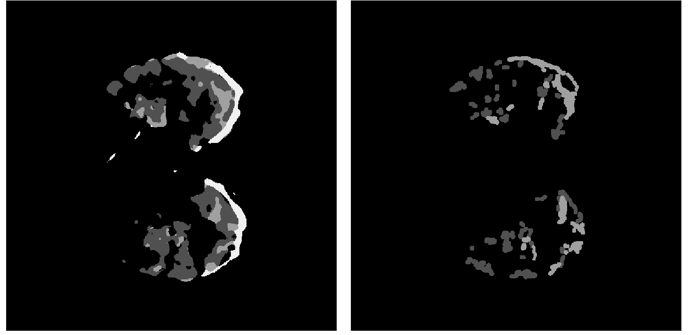
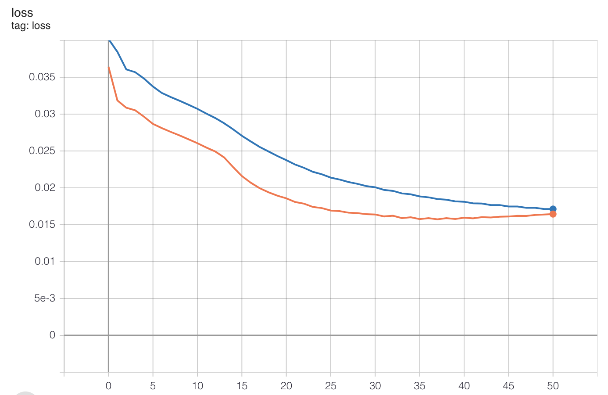

# covidLungCTScan-ImageSegmentation
The details of the experiment done in this project can be found [here](https://bmcmedimaging.biomedcentral.com/articles/10.1186/s12880-020-00529-5)

License and rights to the project can be found [here](https://s100.copyright.com/AppDispatchServlet?title=COVID-19%20lung%20CT%20image%20segmentation%20using%20deep%20learning%20methods%3A%20U-Net%20versus%20SegNet&author=Adnan%20Saood%20et%20al&contentID=10.1186%2Fs12880-020-00529-5&copyright=The%20Author%28s%29&publication=1471-2342&publicationDate=2021-02-09&publisherName=SpringerNature&orderBeanReset=true&oa=CC%20BY%20%2B%20CC0)

The aim of this project is to explore the possibility of using Artificial Intelligence to detect the CoVid infected region in lungs from a CT Scan Image and give the final result.
This being my first full fledged project in this domain of computer vision AI, I have tried to build everything from the basic building blocks of the tensorflow module in order to get a better understanding of its working in the process.

**DATASET :**
Images of the dataset used in this work is a collection of the Italian Society of Medical and Interventional Radiology and can be found [here](http://medicalsegmentation.com/covid19/)

**TRAINING :**
```
python train.py \
    --batch_size = 2
    --my_dataset_dir = ${path to dataset directory} \
    --my_log_dir = ${path to tensorboard log directory}
```

**RESULTS :**




